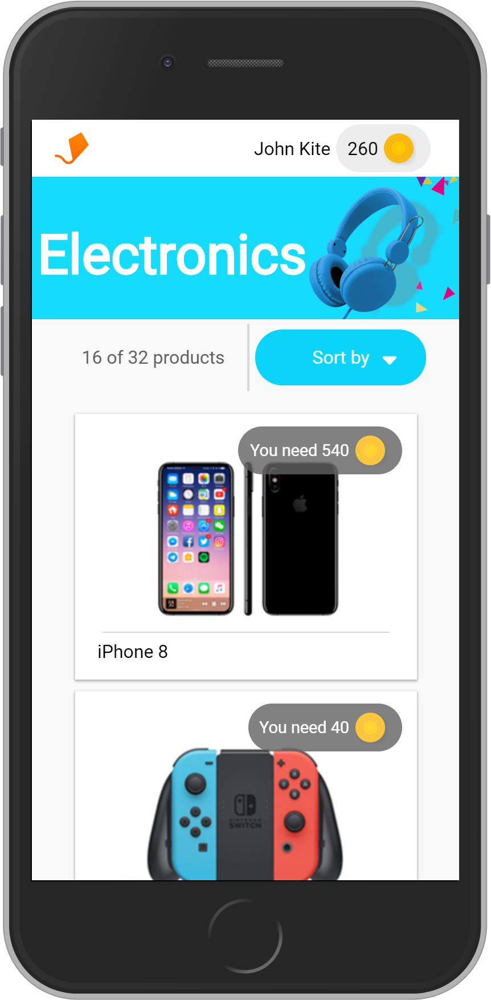
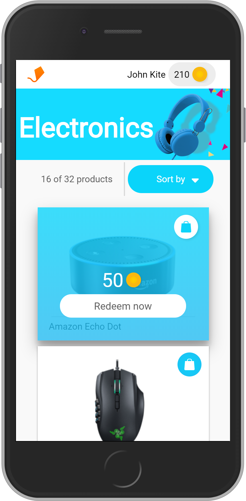

# Coding Challenge

The challenge is to build a catalog view for a loyalty program app. My solution implements a PWA using Next.Js, Redux and Deployment in Now.

[Chek the App](https://code-challenge.aaronsaban98.now.sh/)

 

## How it works

Requires Node.Js 10

* `npm install` to insall dependencies.
* `npm run dev` to run enviromment local.
* `npm run build && npm start` to run enviromment prodution.

## License

MIT
